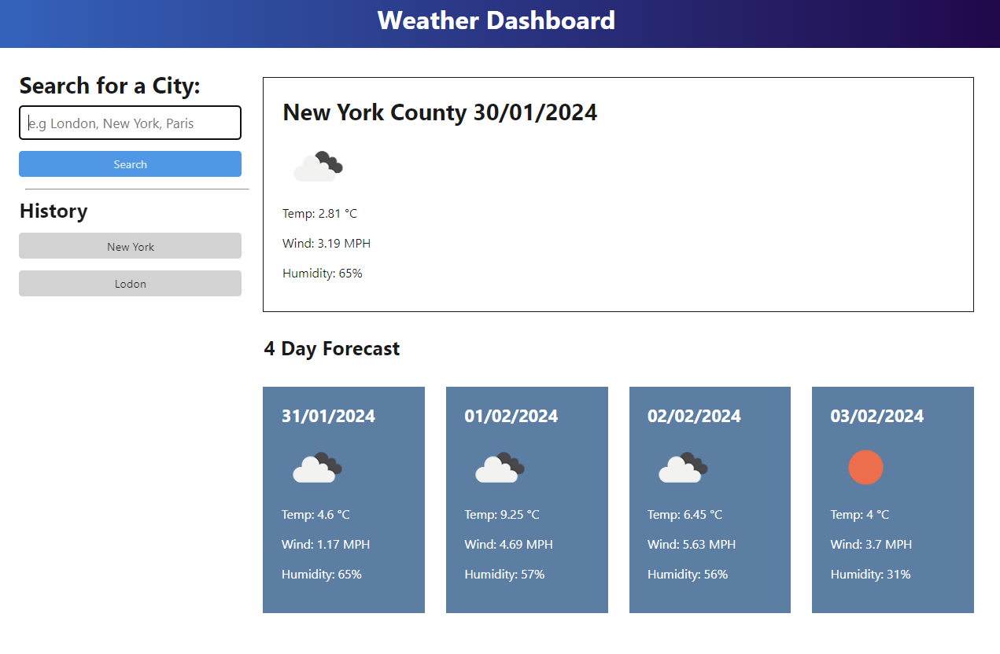

# Weather Forecast Dashboard

An interactive weather dashboard that allows users to see the current conditions and 5-day forecasts for multiple cities. The application utilizes the OpenWeatherMap API for retrieving weather data.

## Features

- Search for the weather outlook of multiple cities.
- Display current conditions including the city name, date, weather icon, temperature, humidity, and wind speed.
- Show a 5-day forecast with date, weather icon, temperature, and humidity.
- Use of localStorage to store persistent data, including search history.

## Demo

Check out the live demo: [Weather Forecast Dashboard](https://prabud0401.github.io/WeatherForecastDashboard/)

## Getting Started

Follow these steps to run the project locally:

1. Clone this repository.
2. Open the `index.html` file in your preferred browser.

## Technologies Used

- HTML
- CSS
- JavaScript
- OpenWeatherMap API

## Deployment

The application is deployed and accessible at [https://prabud0401.github.io/WeatherForecastDashboard/].

## Repository

Explore the code on GitHub: [Weather Forecast Dashboard Repository](https://github.com/prabud0401/WeatherForecastDashboard.git)

## How to Contribute

If you would like to contribute or report issues, please follow these steps:

1. Fork the repository.
2. Create a new branch.
3. Make your changes and commit them.
4. Submit a pull request.

## Acknowledgments

- Thanks to OpenWeatherMap for providing the weather data.

## License

This project is licensed under the MIT License - see the [LICENSE.md](LICENSE.md) file for details.
